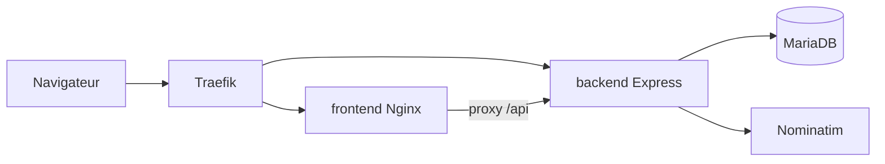

# Architecture

## Composants

- **frontend** : SPA Vue 3 servie par Nginx ; en production, proxy `/api` et `/uploads` vers le backend.
- **backend** : API REST stateless, JWT pour l’écriture.
- **db** : MariaDB, réseau interne uniquement (pas d’exposition Traefik).

## Auth

JWT Bearer après `POST /auth/login` ou `/auth/register`. Lecture des lieux sans token.

## Fichiers uploadés

Stockés dans `data/uploads/` (volume Docker monté sur le backend).
